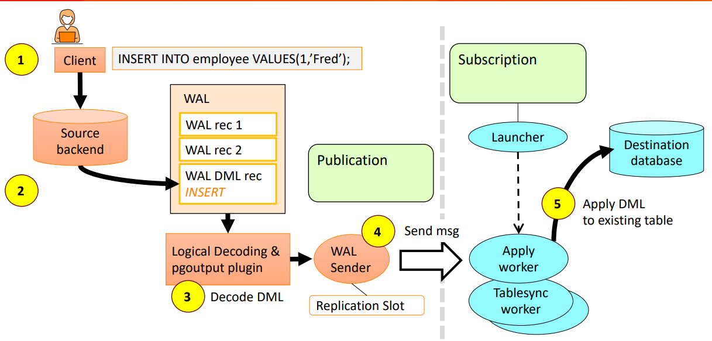
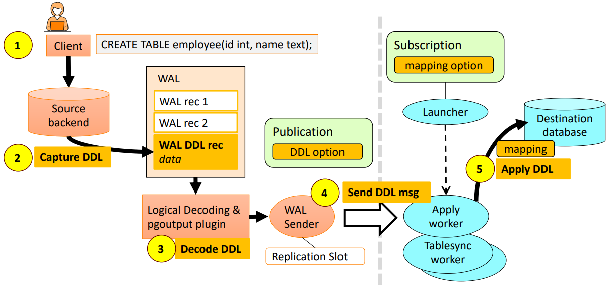

# PostgreSQL Logical Replication with DDL Support

## Overview

This project demonstrates the implementation of **Logical Replication** in PostgreSQL using **Publisher** and **Subscriber** nodes.

Native PostgreSQL logical replication supports **Data Manipulation Language (DML)** operations such as:

- INSERT
- UPDATE
- DELETE
- TRUNCATE

To extend replication support for **Data Definition Language (DDL)** operations, the **pglogical** extension was integrated and configured.

The project was implemented using PostgreSQL built from source and two independent PostgreSQL instances running on separate ports.

---

## Objectives

The primary objectives of this project are:

- Install PostgreSQL from source.
- Configure Publisher and Subscriber instances.
- Implement native logical replication.
- Understand WAL-based logical replication workflow.
- Enable DDL replication using pglogical.
- Demonstrate schema synchronization between nodes.

---

## Technologies Used

- PostgreSQL
- pglogical
- Linux (Ubuntu)
- WAL (Write Ahead Log)
- Logical Decoding
- pgoutput Plugin

---

## System Architecture

### DML Replication Flow



The publisher captures row-level data changes and transmits them through logical replication to the subscriber.

### DDL Replication Flow



Using pglogical, schema modifications are captured and propagated to the subscriber node, ensuring both data and schema remain synchronized.

---

## Environment Setup

### Publisher

- Port: **5432**
- Database: **db1**

### Subscriber

- Port: **5433**
- Database: **db2**

Both instances were initialized using separate data directories and configured for logical replication.

---

## PostgreSQL Configuration

Important parameters used:

```conf
wal_level = logical
max_wal_senders = 10
max_replication_slots = 10
shared_preload_libraries = 'pglogical'
```

---

## DML Replication Demonstrated

The following operations were successfully replicated:

- INSERT
- UPDATE
- DELETE
- TRUNCATE

### Example

```sql
INSERT INTO cricketers VALUES (...);

UPDATE cricketers
SET intr_runs = 25000
WHERE jersey_no = 18;

DELETE FROM cricketers
WHERE jersey_no = 95;
```

---

## DDL Replication Demonstrated

DDL replication was implemented using pglogical and the `replicate_ddl_command()` function.

```sql
SELECT pglogical.replicate_ddl_command(
    'DDL COMMAND',
    ARRAY['ddl_sql']
);
```

The following schema changes were successfully replicated.

### Add Column

```sql
ALTER TABLE cricketers
ADD COLUMN player_type TEXT;
```

### Rename Column

```sql
ALTER TABLE cricketers
RENAME COLUMN total_runs TO intr_runs;
```

### Add New Column

```sql
ALTER TABLE cricketers
ADD COLUMN first_class_runs INTEGER;
```

### Drop Column

```sql
ALTER TABLE cricketers
DROP COLUMN player_type;
```

### Create Table

```sql
CREATE TABLE test_dummy(
    id INTEGER
);
```

---

## Additional Exploration: Event Triggers

As part of the project, PostgreSQL Event Triggers were explored as a possible mechanism for capturing DDL operations.

Event triggers can detect schema changes such as:

- CREATE TABLE
- ALTER TABLE
- DROP TABLE

and execute user-defined functions when such events occur.

Although event triggers are useful for auditing and DDL event detection, they do not provide automatic replication of schema changes between databases. Additional custom logic would be required to capture, transmit, and execute DDL commands on subscriber nodes.

For this reason, **pglogical** was chosen as the primary solution for DDL replication.

---

## Project Outcome

### Successfully Demonstrated

- Native PostgreSQL DML replication
- Publisher–Subscriber architecture
- WAL-based logical replication
- Logical decoding using pgoutput
- pglogical installation and configuration
- DDL replication using pglogical
- Schema synchronization between nodes

### Explored

- PostgreSQL Event Triggers for DDL capture
- Replication slots and subscription management
- PostgreSQL source compilation and custom installation

---

## Key Learnings

- Understanding WAL internals
- Publisher–Subscriber architecture
- Native PostgreSQL logical replication
- Logical decoding process
- Replication slots
- pglogical extension architecture
- DDL propagation using replication sets
- PostgreSQL source compilation and installation

---

## Challenges Faced

- Building PostgreSQL from source
- Configuring multiple PostgreSQL instances
- Installing pglogical manually
- Managing replication slots
- Debugging subscriber synchronization issues
- Understanding DDL replication limitations

---

## Future Work

Future enhancements include:

- Automating the entire replication setup through scripts
- Integrating monitoring solutions to track replication lag
- Extending replication across multiple schemas and databases
- Exploring bi-directional replication architectures
- Contributing towards stronger native DDL replication support within PostgreSQL

---

## Alternative Solutions for DDL Replication

Several solutions exist for handling DDL replication in PostgreSQL environments:

- **pgl_ddl_deploy / logical_ddl** – Extensions that use PostgreSQL Event Triggers to automatically propagate schema changes.
- **pgEdge Spock / EDB PGD** – Multi-master replication platforms that provide automated schema synchronization across distributed PostgreSQL clusters.
- **Debezium / IBM IIDR** – Change Data Capture (CDC) tools that stream database changes, including DDL events, to external systems and data platforms.
